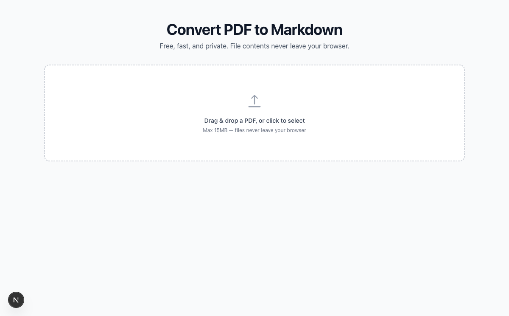

# Convert PDF to Markdown - in the browser, on the CLI, or in your code

[](https://github.com/gmann14/pdf2md/actions/workflows/ci.yml)
[](LICENSE)
[](https://www.npmjs.com/package/@pdf2md/core)
[](https://www.npmjs.com/package/@pdf2md/core)
[](https://www.npmjs.com/package/@pdf2md/mcp)

pdf2md is a free, MIT-licensed PDF-to-Markdown converter for people who need clean Markdown from PDFs without uploading private documents. Use the web app for one-off conversions, the CLI for local files, the TypeScript API in your own tools, or the MCP server from AI agents.

**Try it online:** TODO: replace with the production domain after `q-2026-06-30-001` is answered. Current preview: [pdf2md-five.vercel.app](https://pdf2md-five.vercel.app).



## Quick Start

```bash
pnpm dlx @pdf2md/core document.pdf > document.md
```

```bash
npm install @pdf2md/core
```

```ts
import { convert } from "@pdf2md/core";
import { readFile } from "node:fs/promises";

const buffer = await readFile("document.pdf");
const result = await convert(buffer.buffer);

console.log(result.markdown);
```

## Why pdf2md

| Capability | Status |
| --- | --- |
| Browser conversion with no file upload | [x] |
| CLI and TypeScript library | [x] |
| MCP server for AI agents | [x] |
| Headings, paragraphs, lists, bold, italic, and links | [x] |
| Header/footer stripping and multi-column reordering | [x] |
| Best-effort tables and code blocks | [x] |
| Tagged-PDF structure tree fast path | [x] |
| JSON structured output and RAG-friendly chunking | [x] |
| Multi-file upload with ZIP download | [x] |
| Original PDF beside Markdown comparison view | [x] |
| OCR for scanned PDFs | Not yet |
| Guaranteed high-fidelity complex layouts | Not promised |

pdf2md is strongest on text-based PDFs: reports, whitepapers, documentation, academic papers, and PDFs you want to paste into an LLM context window. It intentionally stays client-side in the web app, so scanned PDFs and deeply complex layouts are better served by heavier OCR or ML tools.

## Web App

Open the web app, drop up to five PDFs, and download Markdown files individually or as one ZIP. Conversion runs in the browser through PDF.js workers; file bytes, extracted text, filenames, and PDF metadata are not uploaded by the app.

The interface includes:

- Drag-and-drop, file picker, and Ctrl/Cmd+V PDF paste.
- Progress, cancellation, reset, and explicit error states for oversized, password-protected, corrupt, and scanned/no-text PDFs.
- Raw Markdown and rendered preview modes.
- Copy, Copy for AI, download `.md`, and download-all `.zip`.
- Optional side-by-side PDF preview for spot-checking.
- Light/dark theme with persisted preference.

## CLI

```bash
npx @pdf2md/core document.pdf > document.md
npx @pdf2md/core --metadata --yaml-front-matter document.pdf > document.md
npx @pdf2md/core --output json --chunk-by heading document.pdf > document.json
```

## TypeScript API

```ts
import { convert } from "@pdf2md/core";

const result = await convert(pdfArrayBuffer, {
  includeMetadata: true,
  yamlFrontMatter: true,
  outputFormat: "json",
  chunkBy: "heading", // also supports "page" and "token"
  maxTokensPerChunk: 800,
  onProgress: ({ stage, currentPage, totalPages }) => {
    console.log(`${stage}: ${currentPage}/${totalPages}`);
  },
});

if (result.status !== "failed") {
  console.log(result.markdown);
  console.log(result.structured?.sections);
  console.log(result.chunks);
}
```

`convert(pdfBuffer, options?)` returns a `ConversionResult`:

| Field | Description |
| --- | --- |
| `status` | `"success"`, `"partial"`, or `"failed"` |
| `markdown` | Markdown output, always present as the stable contract |
| `messages` | Stable warning/error codes for UI and automation |
| `stats` | Page count, word count, and processing time |
| `metadata` | Optional PDF title, author, subject, keywords, and dates |
| `structured` | Optional hierarchy for JSON/RAG workflows |
| `chunks` | Optional page-, heading-, or token-based chunks with source metadata |

Options include `maxPages`, `includeMetadata`, `yamlFrontMatter`, `outputFormat`, `chunkBy`, `maxTokensPerChunk`, `signal`, and `onProgress`.

See [packages/core/README.md](packages/core/README.md) for package-specific API notes.

## MCP Server

Use pdf2md from Claude Code, Cursor, Windsurf, or any MCP-compatible AI agent:

```bash
claude mcp add pdf2md -- npx -y @pdf2md/mcp
```

Or add it to `.mcp.json`:

```json
{
  "mcpServers": {
    "pdf2md": {
      "command": "npx",
      "args": ["-y", "@pdf2md/mcp"]
    }
  }
}
```

The server exposes a `convert_pdf` tool that accepts a local file path and returns Markdown. See [packages/mcp/README.md](packages/mcp/README.md) for the full MCP package docs.

## How It Works

pdf2md uses PDF.js to extract positioned text, links, metadata, and structure-tree data when available. The core pipeline then:

1. Loads the PDF in a worker-compatible path for browser and Node.js.
2. Extracts text items with page, position, font, size, and annotation metadata.
3. Strips repeated headers and footers.
4. Reorders common multi-column pages.
5. Detects headings from font histograms, section patterns, and emphasis signals.
6. Groups lines into paragraphs, lists, code blocks, and safe Markdown tables.
7. Matches link annotations to text spans.
8. Emits Markdown, optional YAML front matter, optional structured sections, and optional chunks.

The detailed product and quality notes live in [docs/spec.md](docs/spec.md), [docs/quality-testing.md](docs/quality-testing.md), and [test-corpus/QUALITY-REPORT.md](test-corpus/QUALITY-REPORT.md).

## Comparison

Verified on 2026-06-30 from each public project/site README or landing page.

| Tool | Best for | Browser, no upload | CLI/library | Tables/OCR/layout depth | Tradeoff |
| --- | --- | --- | --- | --- | --- |
| pdf2md | Private, fast Markdown from text-based PDFs; npm/TypeScript and AI-agent workflows | Yes | TypeScript library, CLI, MCP | Best-effort tables/code/layout; no OCR yet | Not a heavyweight OCR or ML document parser |
| [pdf2md.morethan.io](https://pdf2md.morethan.io/) / [jzillmann/pdf-to-markdown](https://github.com/jzillmann/pdf-to-markdown) | Simple browser conversion | Yes | Older JavaScript project | Basic extraction | Older stack and less active product surface |
| [Marker](https://github.com/datalab-to/marker) | High-accuracy local or managed document conversion | No primary browser-only flow | Python CLI/API | Strong tables, equations, images, OCR, optional LLM mode | Heavier install/runtime; GPL code and model licensing constraints |
| [Docling](https://github.com/docling-project/docling) | Production document AI pipelines and RAG preprocessing | No primary browser-only flow | Python CLI/API and integrations | Strong layout, table structure, OCR, multimodal features | Heavier Python/ML toolchain than a quick browser converter |

The practical choice is simple: use pdf2md when privacy, speed, browser UX, TypeScript, or npm distribution matters. Use Marker or Docling when complex layouts, scanned PDFs, OCR, images, forms, or maximum extraction fidelity matter more than install weight.

## Project Layout

```text
apps/web/          Next.js static web app
packages/core/     @pdf2md/core conversion engine, API, and CLI
packages/mcp/      @pdf2md/mcp server for AI agents
test-corpus/       Real-world PDFs, evaluation scripts, and quality reports
docs/              Product spec, launch plan, quality notes, and runbooks
research/          Competitive and technical research
```

## Development

```bash
git clone https://github.com/gmann14/pdf2md.git
cd pdf2md
pnpm install
pnpm dev
```

Useful commands:

```bash
pnpm typecheck
pnpm test
pnpm lint
pnpm build
pnpm test:corpus-smoke
```

## Tech Stack

- [Next.js 15](https://nextjs.org/) for the SEO-friendly static app shell.
- [PDF.js v5](https://mozilla.github.io/pdf.js/) for PDF parsing and worker-based browser conversion.
- [TypeScript](https://www.typescriptlang.org/) in strict mode.
- [Tailwind CSS v4](https://tailwindcss.com/) for the web UI.
- [Vitest](https://vitest.dev/) and Playwright for unit and workflow coverage.
- [pnpm workspaces](https://pnpm.io/workspaces) for the monorepo.

## Contributing

Issues and focused pull requests are welcome. Start with [CONTRIBUTING.md](CONTRIBUTING.md), then check [docs/spec.md](docs/spec.md) and [test-corpus/QUALITY-REPORT.md](test-corpus/QUALITY-REPORT.md) before changing conversion behavior.

## License

[MIT](LICENSE)
